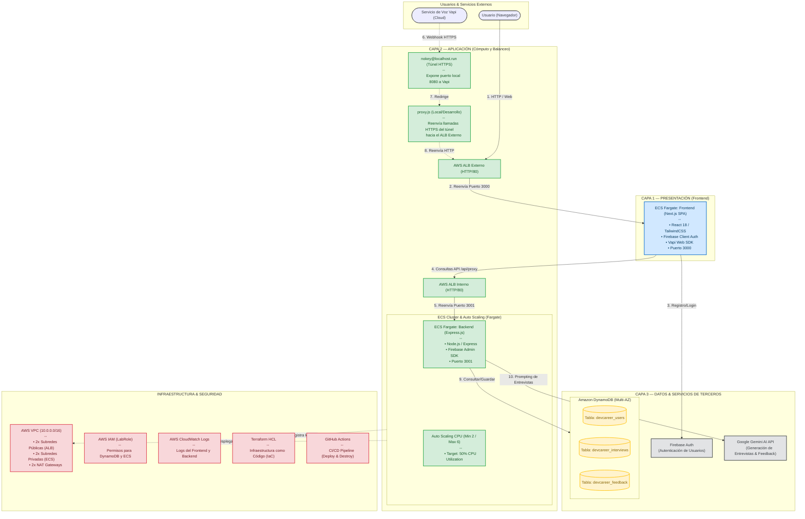

# 📐 Arquitectura Tecnológica General — DevCareer AI

Este documento describe la arquitectura técnica de **DevCareer AI**, inspirada en el modelo de tres capas (Presentación, Aplicación y Datos) y desplegada en **AWS** mediante **Terraform** y **GitHub Actions**.

---

## 🗺️ Diagrama de Arquitectura (Mermaid)

El siguiente diagrama representa los componentes de la aplicación y cómo interactúan entre sí. GitHub renderizará este bloque de forma interactiva.



---

## 🏢 Desglose de las Capas

### 1. Capa de Presentación (Frontend)
* **Tecnología:** Next.js (React), empaquetado en contenedores Docker y ejecutado en **AWS ECS Fargate**.
* **Responsabilidades:**
  * Servir la interfaz de usuario para que los candidatos se registren, inicien sesión y revisen su historial de entrevistas.
  * Iniciar la videollamada interactiva con el Vapi Web SDK.
  * Enrutar todas las llamadas al backend a través de `/api/proxy` (para evitar CORS y simplificar la conectividad).
* **Escalado:** Configurado con un mínimo de **2 tareas** y escalado automático de hasta **6 tareas** si el uso medio de CPU supera el **50%**.

### 2. Capa de Aplicación (Backend y APIs)
* **Tecnología:** Node.js + Express.js ejecutado en **AWS ECS Fargate**.
* **Responsabilidades:**
  * Gestionar la lógica de negocio y las llamadas a la base de datos.
  * Autenticar las sesiones utilizando el SDK de Firebase Admin.
  * Actuar como el Webhook de **Vapi** para procesar la información del usuario en tiempo real y enviar los prompts del bot.
  * Conectarse con la API de **Google Gemini** para la generación dinámica de preguntas de entrevistas y análisis/feedback del resultado.
* **Escalado:** Al igual que el frontend, cuenta con un mínimo de **2 tareas** y máximo de **6 tareas** con escalado dinámico por CPU.

### 3. Capa de Datos (Persistencia)
* **Tecnología:** Amazon DynamoDB (NoSQL).
* **Tablas:**
  * `devcareer_users`: Almacena el perfil del candidato.
  * `devcareer_interviews`: Registra las sesiones de entrevistas iniciadas y completadas.
  * `devcareer_feedback`: Contiene los análisis detallados generados por Gemini.

### 4. Infraestructura y Seguridad
* **Red Aislada (VPC):** Creada con subredes públicas y privadas en múltiples zonas de disponibilidad para alta disponibilidad. Los contenedores Fargate se ejecutan en subredes privadas sin IP pública directa, accediendo al exterior a través de **NAT Gateways**.
* **Seguridad (IAM):** Usa el rol predefinido `LabRole` para otorgar permisos a los contenedores Fargate sin quemar claves.
* **Automatización:**
  * **Terraform:** Define la infraestructura completa como código.
  * **GitHub Actions:** Ejecuta los despliegues limpios y compilaciones cuando se hace push en `main`.

---

## 🎨 ¿Cómo puedes exportar o generar este diagrama en imagen?

Si necesitas el diagrama en formato de imagen (PNG/SVG) para una presentación o documento:
1. **GitHub:** GitHub renderiza el diagrama automáticamente en la página web de este repositorio. Puedes tomar una captura de pantalla directamente.
2. **Mermaid Live Editor:** 
   * Copia todo el código que está dentro del bloque ` ```mermaid ` arriba.
   * Pégalo en [Mermaid Live Editor](https://mermaid.live).
   * Desde allí puedes personalizar colores, tipografías y descargarlo en formato **PNG**, **SVG** o **PDF** con alta calidad de manera inmediata.
